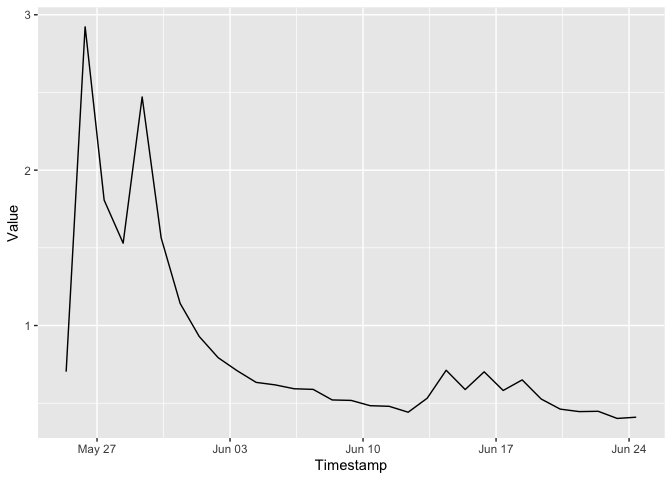

<!-- README.md is generated from README.Rmd. Please edit that file -->

# sepa

<!-- badges: start -->

[](https://github.com/simonmoulds/sepa/actions/workflows/R-CMD-check.yaml)
<!-- badges: end -->

The sepa package provides access to environmental data collected by the
Scottish Environment Protection Agency (SEPA).

## Installation

You can install the development version of sepa from
[GitHub](https://github.com/) with:

``` r
devtools::install_github("simonmoulds/sepa")
#> Skipping install of 'sepa' from a github remote, the SHA1 (2ef40daf) has not changed since last install.
#>   Use `force = TRUE` to force installation
```

## Example

This is a basic example which shows you how to solve a common problem:

``` r
library(dplyr)
#> 
#> Attaching package: 'dplyr'
#> The following objects are masked from 'package:stats':
#> 
#>     filter, lag
#> The following objects are masked from 'package:base':
#> 
#>     intersect, setdiff, setequal, union
```

``` r
library(lubridate)
#> 
#> Attaching package: 'lubridate'
#> The following objects are masked from 'package:base':
#> 
#>     date, intersect, setdiff, union
```

``` r
library(ggplot2)
library(sepa)
```

The steps required to download historical streamflow data are outlined
below:

``` r
grps <- sepa_group_list()
q_grp <- grps |> filter(group_name %in% "StationsWithFlow") |> pull(group_id)
# List stations that measure flow
stns <- sepa_station_list(group_id = q_grp)
# Choose arbitrary station
stn_id <- stns$station_id[1]
available_ts <- sepa_timeseries_list(stn_id)
# Get the timeseries ID for daily mean flow
ts_id <- available_ts |> 
  filter(stationparameter_name == "Flow" & ts_name == "Day.Mean") |> 
  pull(ts_id)
# Retrieve data
ts <- sepa_timeseries_values(ts_id, start_date = Sys.Date() %m-% months(1), end_date = Sys.Date())
head(ts)
#> # A tibble: 6 × 8
#>   Timestamp           Value ts_name  ts_id    Units stationparameter_name
#>   <dttm>              <dbl> <chr>    <chr>    <chr> <chr>                
#> 1 2024-05-25 09:00:00 0.703 Day.Mean 62065010 m³/s  Flow                 
#> 2 2024-05-26 09:00:00 2.92  Day.Mean 62065010 m³/s  Flow                 
#> 3 2024-05-27 09:00:00 1.81  Day.Mean 62065010 m³/s  Flow                 
#> 4 2024-05-28 09:00:00 1.53  Day.Mean 62065010 m³/s  Flow                 
#> 5 2024-05-29 09:00:00 2.47  Day.Mean 62065010 m³/s  Flow                 
#> 6 2024-05-30 09:00:00 1.56  Day.Mean 62065010 m³/s  Flow                 
#> # ℹ 2 more variables: station_name <chr>, station_id <chr>
```

Once we have obtained the data we can plot the timeseries:


